# 🛡️ Prédiction d'Attaques DDoS par Apprentissage Temporel

**Anticiper les attaques DDoS 1 à 10 secondes avant qu'elles ne surviennent**

---

##  Problématique

Les attaques par déni de service distribué (DDoS) saturent les serveurs cibles en générant un volume massif de requêtes malveillantes provenant d'un réseau de machines compromises (botnet). Ces attaques rendent les services indisponibles pour les utilisateurs légitimes.

**Le problème des solutions actuelles** :

Les systèmes de sécurité traditionnels (IDS, pare-feu, antivirus) fonctionnent en mode **réactif**. Ils détectent l'attaque uniquement lorsqu'elle est déjà en cours, c'est-à-dire quand les serveurs sont déjà saturés. À ce moment-là, le service subit déjà une dégradation ou une interruption complète, et il reste très peu de temps pour réagir efficacement.

**Le besoin** :

Disposer d'un système capable de **prédire** l'imminence d'une attaque DDoS quelques secondes à l'avance. Ces quelques secondes d'anticipation permettraient d'activer préventivement les mécanismes de défense, d'allouer des ressources supplémentaires et de minimiser l'impact sur les utilisateurs.

---

##  Approche

### Notre solution

Nous proposons un **système prédictif** basé sur l'intelligence artificielle qui analyse le trafic réseau en continu et détecte les **patterns précurseurs** d'une attaque DDoS.

**L'idée centrale** : Les attaques DDoS ne démarrent pas instantanément. Elles présentent des signatures caractéristiques dans les secondes qui précèdent leur pic : augmentation progressive du volume de trafic, modification des patterns de connexion, homogénéisation des requêtes, etc.

**Notre approche** :
- Analyser le trafic réseau comme une **série temporelle** (et non comme des événements isolés)
- Utiliser les données des 30 dernières secondes pour prédire l'état du système dans 1, 5 ou 10 secondes
- Transformer le problème de détection en un problème de **prédiction temporelle**

 
### Comment créer des séquences temporelles ?

C'est le cœur de notre approche. Au lieu d'analyser chaque seconde de manière isolée, nous créons des **fenêtres d'observation** qui capturent l'évolution du trafic.

#### Principe de la fenêtre glissante

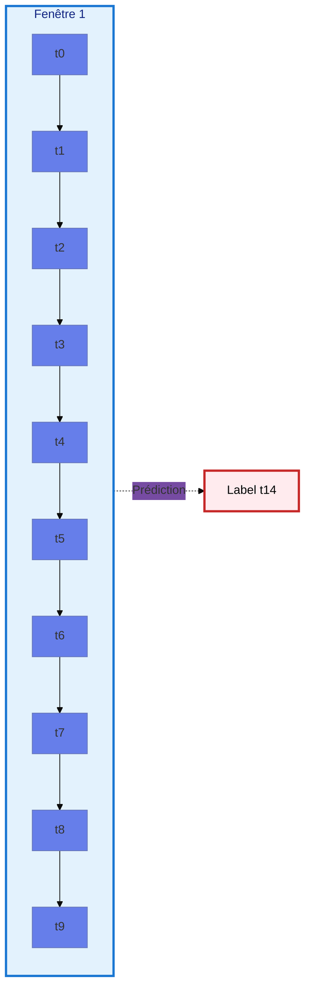

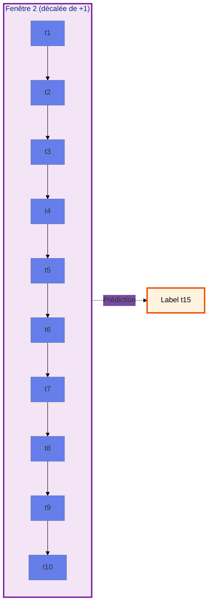

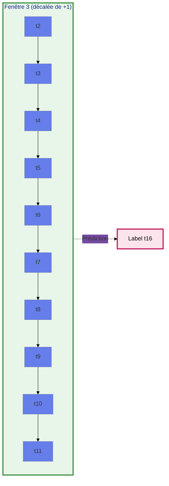

#### Calcul détaillé avec exemple

Prenons un exemple concret avec :
- **seq_length** = 10 (fenêtre de 10 secondes)
- **horizon** = 5 (prédiction 5 secondes à l'avance)

**Pour la première séquence (position i=0)** :

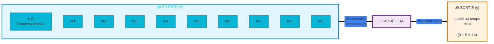

**Calcul** :
- Entrée : `data[0:10]` → données des temps 0, 1, 2, 3, 4, 5, 6, 7, 8, 9
- Sortie : `label[0 + 10 + 5 - 1]` = `label[14]`
- **Interprétation** : En observant le trafic de t=0 à t=9, on prédit l'état à t=14

**Pour la deuxième séquence (position i=1)** :

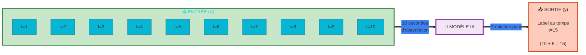

**Calcul** :
- Entrée : `data[1:11]` → données des temps 1, 2, 3, 4, 5, 6, 7, 8, 9, 10
- Sortie : `label[1 + 10 + 5 - 1]` = `label[15]`

#### Formule générale

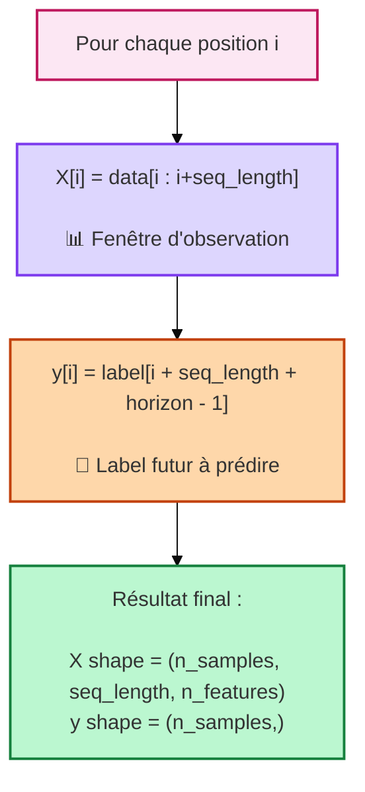

**Ce que le modèle apprend** :

Le modèle analyse ces séquences et apprend à détecter :
- Les **variations temporelles** : augmentation progressive du trafic
- Les **patterns répétitifs** : rafales de requêtes similaires
- Les **anomalies séquentielles** : changements soudains dans les métriques réseau

---

## 🏗️ Architecture

### Pipeline complet du projet

```mermaid
%%{init: {'theme':'base', 'themeVariables': { 'primaryColor':'#667eea','secondaryColor':'#764ba2'}}}%%
flowchart LR
    subgraph DATA["📦 DONNÉES<br/>─────────"]
        D1["CICIDS2017<br/>(Trafic réaliste)"]
        D2["CICDDOS2019<br/>(12 types DDoS)"]
    end
    
    subgraph CLEAN["🧹 PREPROCESSING<br/>─────────"]
        C1["• Nettoyage<br/>• Label binaire<br/>• Tri chrono"]
    end
    
    subgraph AGG["⏱️ AGGREGATION<br/>─────────"]
        A1["• Par seconde<br/>• Feature selection"]
    end
    
    subgraph SPLIT["✂️ SPLIT TEMPOREL<br/>─────────"]
        S1["Train: 70%<br/>(Passé)"]
        S2["Test: 30%<br/>(Futur)"]
    end
    
    subgraph NORM["📊 NORMALISATION<br/>─────────"]
        N1["RobustScaler<br/>(Anti-outliers)"]
    end
    
    subgraph SEQ["🔄 SÉQUENCES<br/>─────────"]
        Q1["Fenêtre glissante<br/>seq_length=10"]
        Q2["H=1 sec"]
        Q3["H=5 sec"]
        Q4["H=10 sec"]
    end
    
    subgraph MODEL["🤖 MODÈLE<br/>─────────"]
        M1["XGBoost<br/>300 arbres<br/>depth=8<br/>lr=0.05"]
    end
    
    subgraph PRED["✅ PRÉDICTION<br/>─────────"]
        P1["Accuracy: 97%<br/>Precision: 96%<br/>Recall: 94%"]
    end
    
    DATA ==> CLEAN
    CLEAN ==> AGG
    AGG ==> SPLIT
    SPLIT ==> NORM
    NORM ==> SEQ
    SEQ ==> MODEL
    MODEL ==> PRED
    
    style DATA fill:#e3f2fd,stroke:#1565c0,stroke-width:3px
    style CLEAN fill:#fff3e0,stroke:#e65100,stroke-width:3px
    style AGG fill:#f3e5f5,stroke:#6a1b9a,stroke-width:3px
    style SPLIT fill:#e8f5e9,stroke:#2e7d32,stroke-width:3px
    style NORM fill:#fff9c4,stroke:#f9a825,stroke-width:3px
    style SEQ fill:#fce4ec,stroke:#c2185b,stroke-width:3px
    style MODEL fill:#e0f2f1,stroke:#00695c,stroke-width:3px
    style PRED fill:#c8e6c9,stroke:#1b5e20,stroke-width:3px
```

### Détail de chaque étape

```mermaid
%%{init: {'theme':'base', 'themeVariables': { 'primaryColor':'#06b6d4','secondaryColor':'#8b5cf6'}}}%%
graph LR
    A[📦 CICIDS2017<br/>CICDDOS2019] -->|CSV files| B[🧹 Cleaning<br/>Remove NaN/Inf<br/>Binary labels]
    B -->|Clean data| C[⏱️ Time Aggregation<br/>Group by second<br/>Calculate stats]
    C -->|Aggregated| D[✂️ Temporal Split<br/>Train 70%<br/>Test 30%]
    D -->|Train/Test| E[📊 RobustScaler<br/>Fit on train<br/>Transform all]
    E -->|Normalized| F[🔄 Sequences<br/>Sliding windows<br/>Multi-horizon]
    F -->|Sequences| G[🤖 XGBoost Training<br/>n_estimators=300<br/>max_depth=8]
    G -->|Trained model| H[✅ Predictions<br/>& Evaluation]
    
    style A fill:#dbeafe,stroke:#0284c7,stroke-width:2px
    style B fill:#fef3c7,stroke:#d97706,stroke-width:2px
    style C fill:#e9d5ff,stroke:#9333ea,stroke-width:2px
    style D fill:#d1fae5,stroke:#059669,stroke-width:2px
    style E fill:#fed7aa,stroke:#ea580c,stroke-width:2px
    style F fill:#fbcfe8,stroke:#be185d,stroke-width:2px
    style G fill:#ccfbf1,stroke:#0d9488,stroke-width:2px
    style H fill:#bbf7d0,stroke:#16a34a,stroke-width:2px
```

### Focus sur la création des 3 datasets

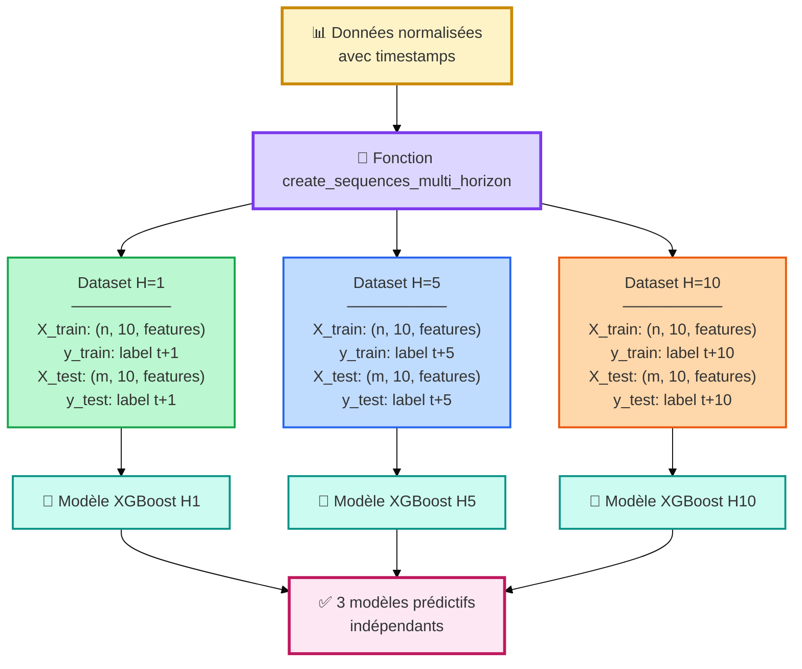

---

## 📊 Performances

### Résultats du modèle XGBoost

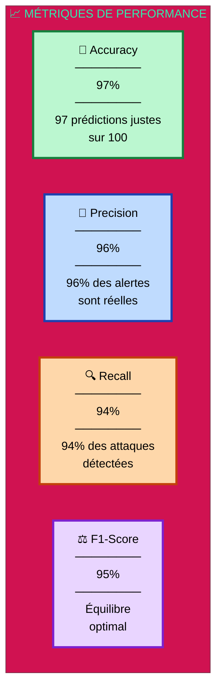

### Visualisation des performances

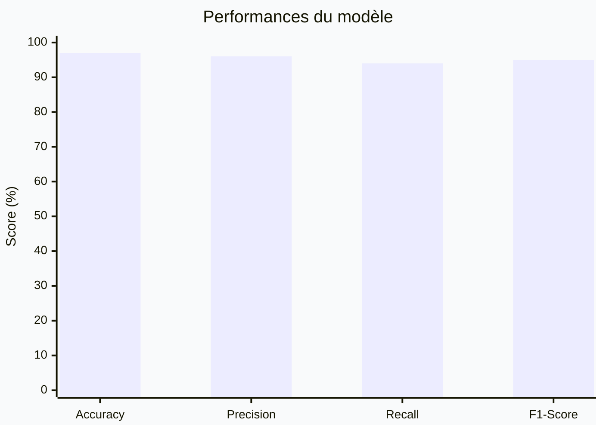

### Matrice de confusion conceptuelle

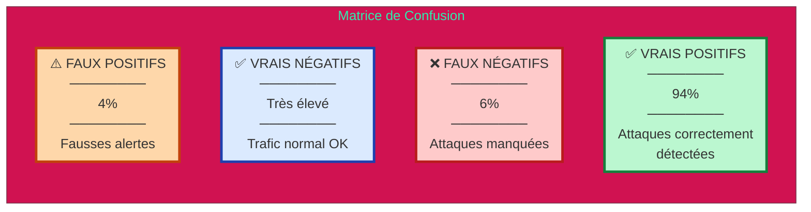

 

### Comparaison avec solutions existantes

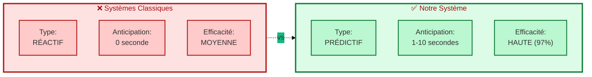

---

## 🛠️ Technologies

**Datasets** : CICIDS2017 • CICDDOS2019

---

## 📫 Contact

**[Votre Nom]**

---

⭐ **Si ce projet vous intéresse, n'hésitez pas à lui donner une étoile !**

