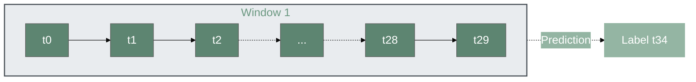
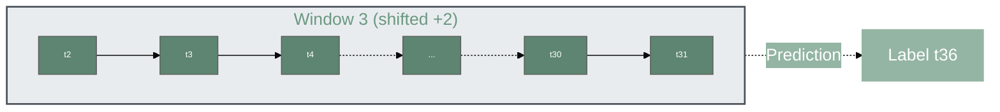

# Forecasting DDoS Attacks 1 to 10 Seconds Before Occurrence

 
We propose an AI-powered predictive system designed to continuously analyze network traffic and identify early precursor patterns of a DDoS attack before full-scale impact.

The objective is to transition from traditional reactive mitigation strategies to proactive, real-time threat anticipation using machine learning.

 

---

## The Challenge

Distributed Denial of Service (DDoS) attacks aim to overwhelm target servers by generating a massive volume of malicious requests from a network of compromised machines (botnets).  

These attacks result in service outages, preventing legitimate users from accessing essential resources.

 

 

---

## Core Concept

DDoS attacks do not reach their peak instantaneously. Instead, they exhibit characteristic signatures in the seconds preceding the traffic flood, including:

- A progressive surge in traffic volume  
- Shifting connection patterns  
- Increasing request homogenization  

These early indicators provide a critical opportunity for anticipation.

---

##  Architecture

 

## Our Methodology

### Time-Series Analysis
Network traffic is treated as a continuous time series rather than a collection of isolated events, allowing the system to capture temporal dependencies and evolving patterns.

### Proactive Forecasting
The model analyzes traffic data from the previous **30 seconds** to predict the network state **1, 5, and 10 seconds** into the future.

### Paradigm Shift
By reframing intrusion detection as a **temporal prediction problem**, we move the defense line forward—enabling mitigation **before** the attack fully materializes.

 
### How Do We Create Temporal Sequences?

This is the core of our approach.

Instead of analyzing each second of network traffic in isolation, we construct **temporal sequences** using observation windows that capture the dynamic evolution of traffic over time.

---

## Dataset Requirements

Before generating temporal sequences, the dataset must satisfy two critical conditions:

### 1. Chronological Ordering

The dataset must be strictly ordered by time.

- Rows must follow a consistent temporal sequence.
- Any shuffled or unordered data will break temporal consistency.
- Time continuity is essential for learning meaningful sequential patterns.

### 2. Uniform Temporal Granularity

All rows must share the same time granularity.

In our case:

- After feature selection and data cleaning,
- The dataset was aggregated **per second**.

This means:

> Each row represents exactly **one second of network traffic information**.

Uniform granularity ensures:
- Temporal consistency
- Stable window construction
- Reliable forecasting behavior

---

#### Sliding Window Principle

We generate fixed-length time windows that move forward progressively.

- Each window spans a predefined duration (e.g., **30 seconds**).
- The data within this window forms a **single input sequence** for the model.
- The window then shifts forward by a fixed step (e.g., **1 second**), producing a new sequence.

This creates overlapping sequences that preserve temporal continuity.

---
 

 

If:

- Window size = 30 seconds  
- Step size = 1 second  
- Dataset granularity = 1 row per second  

Then:

- Sequence 1 → seconds 1–30  
- Sequence 2 → seconds 2–31  
- Sequence 3 → seconds 3–32  
- ...

This produces a continuously updating predictive pipeline.

**Calculation**:
- Input: `data[0:30]` → data from times 0, 1, 2, 3, ..., 27, 28, 29
- Output: `label[0 + 30 + 5 - 1]` = `label[34]`

**For the second sequence (position i=1)**:

 
**Calculation**:
- Input: `data[1:31]` → data from times 1, 2, 3, 4, ..., 28, 29, 30
- Output: `label[1 + 30 + 5 - 1]` = `label[35]`

**For the third sequence (position i=2)**:

 
**Calculation**:
- Input: `data[2:32]` → data from times 2, 3, 4, 5, ..., 29, 30, 31
- Output: `label[2 + 30 + 5 - 1]` = `label[36]`
 

 

 
 
#### General formula

For any sequence at position i:

**Calculation**:
- Input: `data[i:i+seq_length]` → data from times i, i+1, i+2, ..., i+(seq_length-1)
- Output: `label[i + seq_length + horizon - 1]`

 

 
 
---

 

**Datasets** :  

---

##  Contact

**[IDER TILLELI]**

---

 

